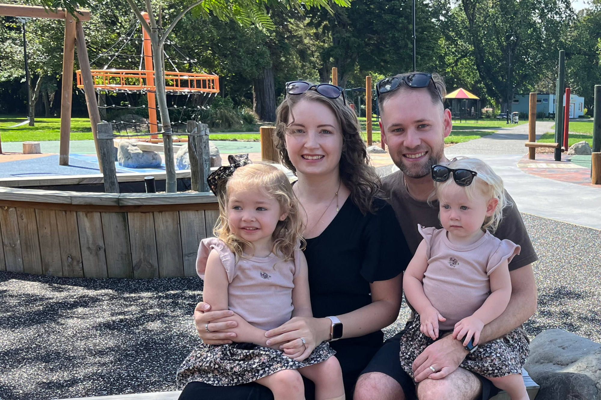

# OUR STORY

A few weeks after we were married in March 2018, we packed up our lives and headed overseas. We believed that God had led us to ‘Travel by Faith’ for our first year of marriage. This ended up including six months in Thailand serving with OMF as homeschool teachers. It was during this time that God laid a burden on our hearts for the people of Thailand and started directing us to return long term. Since returning to NZ we have continued to journey with OMF as Jason completed his Bachelor of Theology and we welcomed Faith and Tikvah (Tivvy) into our family.

# TRAVELLING BY FAITH

Once we arrive in Thailand there will be much for us to learn. We will spend our first year at OMF’s Daniel Training Centre in Lopburi, studying the language and culture whilst fellowshipping with a local Thai church. During this time, we will also work together with OMF to discern our best placement in ministry. This will involve visiting various missionaries around the country and experiencing different ministries. During the next few years, we expect to work in supportive roles alongside more experienced missionaries.
Parenthood is also a journey of faith. Faith and Tivvy will have much to learn (as all kids do) with the additional challenge of growing up in a culture that is different to that of their passport country. We are grateful that OMF has a strong focus on caring for the wellbeing of missionary children, with many resources available to assist their members in this unique task. We were
both raised in homeschooling families, so we feel well equipped for the challenge of homeschooling and raising ‘Third Culture Kids.’

# FACING A TASK UNFINISHED

When we were in Thailand we learnt about the great need there, since Buddhism is closely linked with national identity. It is a nation of 70 million people with less than one percent being Christian. Many of Thailand’s believers are located in the north, meaning that many districts across the rest of the country have no church at all, and there is no opportunity for people to hear the gospel. OMF is working hard to plant churches in unreached districts, bringing the life and hope of Christ to those who may not otherwise hear.

# HOW YOU CAN PARTNER WITH US
Cross-cultural ministry is not something we can do alone; being part of a team is vital. We would be privileged to have you share with us in this adventure.

## PRAYER SUPPORT
We are in a spiritual battle, with Satan continually looking for ways to compromise us as we seek to follow God’s call. We would appreciate your prayers as we prepare, that we may be equipped for the work ahead. Please consider receiving our regular prayer letter, or follow our faith journey on [Facebook](www.facebook.com/JSL.travellingbyfaith).

<!-- Begin Mailchimp Signup Form -->
<link href="//cdn-images.mailchimp.com/embedcode/classic-071822.css" rel="stylesheet" type="text/css">

    <form action="https://facebook.us19.list-manage.com/subscribe/post?u=ea5ffbcabbcfcaba7d24da752&amp;id=339d873e05&amp;f_id=00f68ee4f0" method="post" id="mc-embedded-subscribe-form" name="mc-embedded-subscribe-form" class="validate" target="_blank" novalidate>
        

        <h2>Subscribe to our email newsletter</h2>
        
* indicates required

	<label for="mce-EMAIL">Email Address  *
</label>
	<input type="email" value="" name="EMAIL" class="required email" id="mce-EMAIL" required>
	

	<label for="mce-FNAME">First Name </label>
	<input type="text" value="" name="FNAME" class="" id="mce-FNAME">
	

	<label for="mce-LNAME">Last Name </label>
	<input type="text" value="" name="LNAME" class="" id="mce-LNAME">
	

<input type="hidden" name="tags" value="6302645">

	

		

		

	
    <!-- real people should not fill this in and expect good things - do not remove this or risk form bot signups-->
    
<input type="text" name="b_ea5ffbcabbcfcaba7d24da752_339d873e05" tabindex="-1" value="">

        <!-- 

            

                <input type="submit" value="Subscribe" name="subscribe" id="mc-embedded-subscribe" class="button">
                

            

        
 -->
    

</form>

<!--End mc_embed_signup-->

## FINANCIAL SUPPORT
We are trusting God to provide for our needs as we make steps towards serving in Thailand. Financial support is a practical way that you can partner with us, enabling us to go and share Christ’s love overseas. If you would like to be part of our support team, head to [the OMF website](https://omf.org/nz/giving/) to find out how to get set up.

